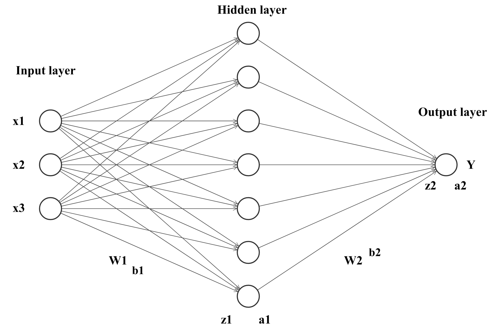

In this notebook, we will build a simple network architecture from scratch and train it with mini-batch gradient descent.

The goal is to predict median house values in logs for regions using a few predictors. Training and test split:

```{r}
# Loading the dataset and log-transforming the outcome variable
dataset <- read.csv("data.csv")
dataset$median_house_value <- log(dataset$median_house_value)

# Training/test split
set.seed(24)
training_indices <- sample(1:nrow(dataset), nrow(dataset)/2)
training_dataset <- dataset[training_indices,]
training_X <- as.matrix(dataset[training_indices, !(colnames(training_dataset) %in% "median_house_value")])
training_y <- dataset[training_indices, "median_house_value"]
test_X <- as.matrix(dataset[-training_indices, !(colnames(training_dataset) %in% "median_house_value")])
test_y <- dataset[-training_indices, "median_house_value"]
```

The architecture we will use is a simple one hidden layer feedforward neural network (drawn with http://alexlenail.me/NN-SVG/index.html and annotated):

<br>
<center>
{width=50%}
</center>
<br>

Specifying the hidden layer to be of size 64 and initialising weights with $N(0,\sigma)$:

```{r}
# Number of features in data
input_dim <- 3

# Number of hidden layer neurons
hidden_layer_size <- 64

# Storing weights in a list and initialising
weights_init = list()
weights_init[["W1"]] <- matrix(rnorm(input_dim*hidden_layer_size, sd = 0.0001), nrow = input_dim, ncol = hidden_layer_size)
weights_init[["b1"]] <- rep(0, hidden_layer_size)
weights_init[["W2"]] <- matrix(rnorm(hidden_layer_size, sd = 0.0001), nrow = hidden_layer_size, ncol = 1)
weights_init[["b2"]] <- 0
```

Cost function and derivatives in matrix notation:

$$J(\theta) = \frac{1}{2}\sum(y-\hat{y})^{2}$$

$\frac{\partial J}{\partial W^{(1)}} = -X^{'} \left( (y-\hat{y}) W^{(2)'} \odot g'(z^{(1)})\right)$ 

$\frac{\partial J}{\partial b^{(1)}} = -1^{'} \left( (y-\hat{y}) W^{(2)'} \odot g'(z^{(1)})\right)$ 

$\frac{\partial J}{\partial W^{(2)}} = -a^{(1)'}(y-\hat{y})$ 

$\frac{\partial J}{\partial b^{(2)}} = -1^{'}(y-\hat{y})$ 

It is very convenient to write these derivatives with matrix notation as it immediately aggregates the observations, however, doing so requires to use some vector calculus. For the derivation and an excellent discussion of these derivatives, see these [notebooks](https://github.com/stephencwelch/Neural-Networks-Demystified) (in particular notebook 4) which are the basis of this notebook's derivations. Note that the author uses slightly different layer numbering and furthermore combines biases and weights into a single $W$ matrix with the first column in $X$ being ones, whereas here we follow the notation of the lecture with $W$ and $b$ separately. 

Defining some key functions which will be part of the final training function:

```{r}
# Sigmoid activation function
sigmoid <- function(x) {
  
  return(1 / (1 + exp(-x)))
  
}

# Derivative of the sigmoid activation function
sigmoid_prime <- function(x) {
  
  return(exp(-x) / (1 + exp(-x))^2)
  
}

# Prediction function for the neural network given a set of weights
nn_predict <- function(X, weights) {
  
  # Forward-pass in the one hidden layer regression neural network
  
  z1 <- X%*%weights[["W1"]] + weights[["b1"]]
  a1 <- sigmoid(z1)
  z2 <- a1%*%weights[["W2"]] + weights[["b2"]]
  y <- z2 # linear activation
  
  return(y)
  
}

# Cost function
J <- function(X, y, weights) {
  
  y_hat <- nn_predict(X, weights)
  
  cost <- 0.5 * sum((y - y_hat)^2)
  
  return(cost)
  
}

# Derivative of cost function evaluated at a (X,y) 
J_prime <- function(X, y, weights) {
  
  # Forward pass
  z1 <- X%*%weights[["W1"]] + weights[["b1"]]
  a1 <- sigmoid(z1)
  z2 <- a1%*%weights[["W2"]] + weights[["b2"]]
  y_hat <- z2
  
  # Derivatives
  dJdW1 <- -t(X)%*%((y - y_hat)%*%t(weights[["W2"]])*sigmoid_prime(z1))
  dJdb1 <- c(t(rep(1, length(y)))%*%((y - y_hat)%*%t(weights[["W2"]])*sigmoid_prime(z1)))
  dJdW2 <- -t(a1)%*%(y - y_hat)
  dJdb2 <- c(-t(rep(1, length(y)))%*%(y - y_hat))
  
  # Combining derivatives into a list
  gradients_list <- list("dJdW1" = dJdW1,
                                 "dJdb1" = dJdb1,
                                 "dJdW2" = dJdW2,
                                 "dJdb2" = dJdb2)
  
  return(gradients_list) 
  
}


```

Training function:

```{r}
train <- function(X,
                  y,
                  weights,
                  n_epochs,
                  batch_size,
                  learning_rate) {
  
  
  # Function which trains the network weights with mini-batch gradient descent
  # and returns the trained weights
  
  print(paste("Cost before training: ", round(J(X, y, weights), 2), sep = ""))
  
  # Loop over epochs
  for (ee in 1:n_epochs) {
    
    # Shuffle indices
    indices <- sample(1:nrow(X))
    
    # Create batches of indices 
    indices_batches <- split(indices, ceiling(seq_along(indices)/batch_size))
    
    # Loop over batches
    for (bb in indices_batches) {
      
      # X & y values current batch
      X_batch <- X[bb,]
      y_batch <- y[bb]
      
      # Return gradient values for this batch
      gradients_batch <- J_prime(X_batch, y_batch, weights) 
      
      # Mini-batch gradient descent updates
      weights[["W1"]] <- weights[["W1"]] - learning_rate * gradients_batch[["dJdW1"]]/batch_size
      weights[["b1"]] <- weights[["b1"]] - learning_rate * gradients_batch[["dJdb1"]]/batch_size
      weights[["W2"]] <- weights[["W2"]] - learning_rate * gradients_batch[["dJdW2"]]/batch_size
      weights[["b2"]] <- weights[["b2"]] - learning_rate * gradients_batch[["dJdb2"]]/batch_size
      
    }
    
    print(paste("Cost after episode ", ee, ": ", round(J(X, y, weights), 2), sep = ""))
    
  }
  
  return(weights)
  
}
```

Training:

```{r}
weights_trained <- train(X = training_X,
                         y = training_y,
                         weights = weights_init,
                         n_epochs = 5,
                         batch_size = 512,
                         learning_rate = 0.01)
```

Test set predictions:

```{r}
# Benchmark
linear_model <- lm(median_house_value~., data = training_dataset)
y_hat_lm <- predict(linear_model, x = test_X)

# Neural network
test_y_hat_before_training <- nn_predict(test_X, weights_init)
test_y_hat <- nn_predict(test_X, weights_trained)

print(paste("The linear regression test RMSE is: ", round(sqrt(mean((test_y - y_hat_lm)^2)),2), sep = ""))
print(paste("The neural network test RMSE before training is: ", round(sqrt(mean((test_y - test_y_hat_before_training)^2)),2), sep = ""))
print(paste("The neural network test RMSE after training is: ", round(sqrt(mean((test_y - test_y_hat)^2)),2), sep = ""))
```

The neural network has indeed already learned significantly even with the simple gradient descent and very few episodes used here. Note, however, that e.g. using an outcome variable without logs can already require much more tuning of the learning rate (e.g. a very small learning rate with many episodes and long training time) and other hyper-parameters in order for weights not to diverge here.


References

- https://github.com/stephencwelch/Neural-Networks-Demystified, in particular the notebook for Part 4
- https://www.3blue1brown.com/lessons/backpropagation-calculus